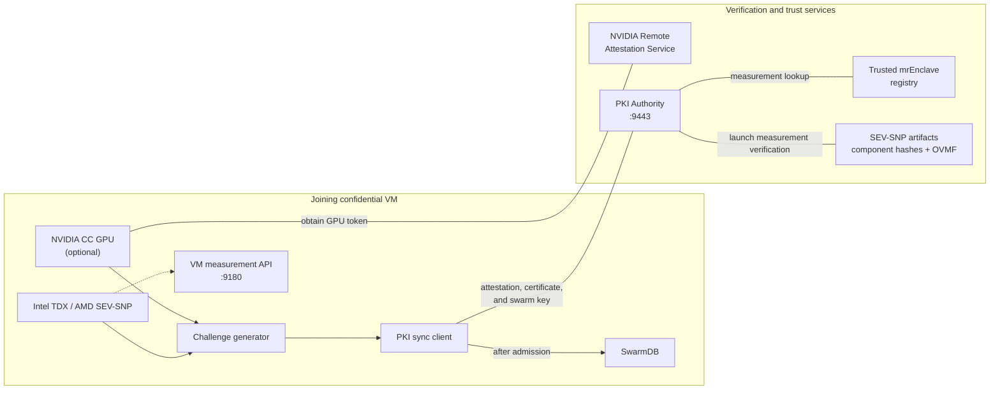
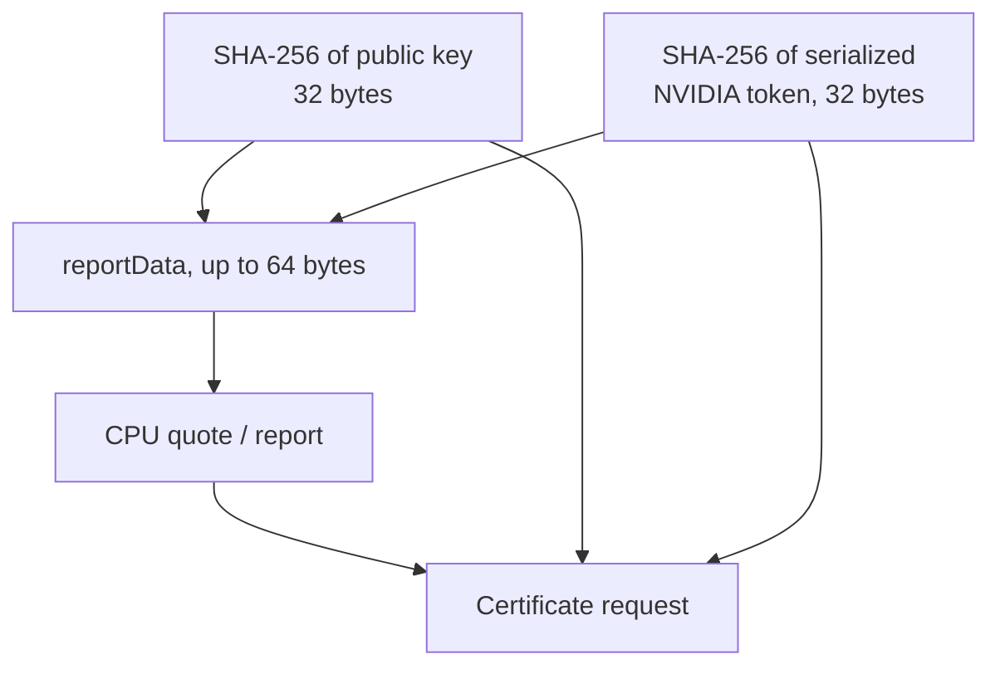

# Architecture and Trust Model

## Components



### Challenge Generator

The challenge generator detects the CPU TEE type, creates CPU evidence, and
obtains an NVIDIA token when an NVIDIA GPU is present. The future certificate
public key and the NVIDIA token are bound to CPU evidence through
`reportData`.

### PKI Sync Client

The PKI sync client is used by joining VMs. Before requesting secrets, it
validates the configured root CA: its network type, embedded CPU evidence, and
whether its `mrEnclave` is allowed by the trusted registry. It then obtains
its own certificate and requests the `swarm key` over a protected connection.

### PKI Authority

The PKI Authority validates the new CPU/GPU challenge, confirms that it is
bound to the requested public key, and applies admission rules for the TEE type
and `mrEnclave`. Only after all checks pass does it issue a certificate with a
server-added marker recording successful attestation.

### VM Measurement API

The local service on port `9180` returns:

```json
{
  "type": "<hardware evidence type>",
  "evidence": "<base64>",
  "mrenclaveHex": "<hex>"
}
```

The service creates evidence with a zero-filled 64-byte `reportData`. It is
used to measure a running VM and does not replace the enrollment challenge, in
which `reportData` is bound to the certificate key and GPU token.

## Trust Roots

The normal trusted flow relies on several independent trust roots:

| Trust root | What it proves |
|---|---|
| CPU manufacturer | Authenticity of the TDX quote or SEV-SNP report and the platform TCB state. |
| GPU manufacturer | Authenticity of the NVIDIA token, firmware, driver, and VBIOS evidence. |
| Trusted measurement registry | The calculated `mrEnclave` is allowed for the trusted network. |
| Swarm-specific PKI root CA | A certificate and node belong to the selected trusted network. |
| Build artifact hashes | OVMF and other SEV-SNP calculation inputs have not been substituted. |

No single result replaces the others. A valid hardware quote proves platform
authenticity, while the trusted registry determines whether the measured VM
state is allowed.

## Evidence Binding



Without a GPU, `reportData` contains only the 32-byte public-key hash. With a
GPU:

```text
reportData = publicKeyHash || nvidiaTokenHash
```

The PKI Authority independently calculates both hashes and compares them with
the verified CPU `reportData`. A valid GPU token or CPU quote therefore cannot
be moved to another certificate request.

## VM Mode

The VM mode is derived from three groups of fields in
`/sp/swarm/config.yaml`:

| `swarm_db.join_addresses` | `pki_authority.caBundle` | `pki_authority.servers` | Result |
|---|---|---|---|
| empty | empty | empty | `init`: first VM |
| populated | populated | populated | `normal`: joining VM |
| any partial combination | | | configuration error |

The result is stored in `/etc/swarm/swarm-vm-mode` and selects one of two
mutually exclusive paths:

- `init` creates the PKI chains locally;
- `normal` synchronizes with an existing PKI Authority.

## Node Admission Order

1. Before attestation, the node does not have the shared `swarm key`.
2. The node validates the existing network root CA.
3. The PKI Authority validates the node CPU/GPU challenge.
4. The node receives a certificate carrying the successful-attestation marker.
5. The node uses the certificate to obtain the `swarm key`.
6. Only then is the SwarmDB configuration created and the management
   components started.

Access to the symmetric network secret is therefore a consequence of
successful attestation, not a prerequisite for it.
