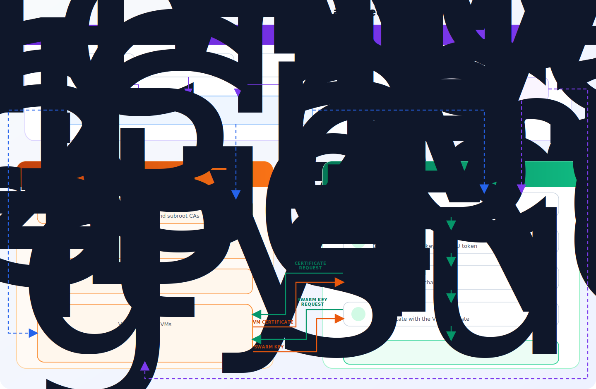
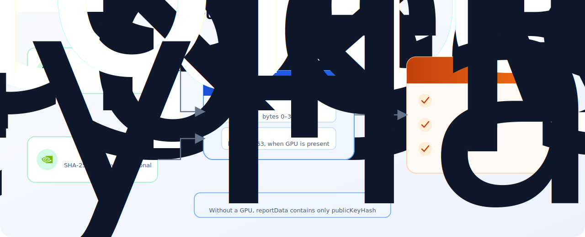

# Architecture and Trust Model

## Overview

A trusted VM starts in one of two mutually exclusive modes. The mode is derived
from the configuration before attestation begins.

| Mode | Purpose |
|---|---|
| Bootstrap VM (`init`) | Initialize a new Swarm. |
| Joining VM (`normal`) | Add a VM to an existing Swarm. |

## General Flow


<!-- Mermaid source: assets/mermaid/architecture-overview.mmd -->

The diagram contains three parts:

- **Bootstrap VM:** initializes a new Swarm network by creating its PKI
  certificates and `swarm key`. The bootstrap VM hardware evidence is embedded
  in the
  [root-certificate extension](06-pki.md#certificate-extensions-and-oids).
- **Joining VM:** validates the provided network root CA and creates an
  attestation challenge for the certificate request. After verifying the
  challenge, the PKI Authority issues a VM certificate that provides access to
  the `swarm key`.
- **Trust sources:** Intel PCS, AMD KDS, and NVIDIA NRAS provide manufacturer data
  for hardware evidence verification. The trusted `mrEnclave` registry provides
  the measurements allowed for joining a trusted network.

The complete bootstrap and joining sequences are described in
[First VM Bootstrap](02-first-vm-bootstrap.md) and
[Joining Subsequent VMs](03-node-join.md).

## Trust Sources

The normal trusted flow relies on several independent trust sources:

| Source | What it proves |
|---|---|
| Intel PCS | Authenticity of the TDX quote and the platform TCB state. |
| AMD KDS | Authenticity of the VCEK and SEV-SNP certificate chain, and certificate revocation lists. |
| NVIDIA NRAS | Authenticity of the NVIDIA token, firmware, driver, and VBIOS evidence. |
| Trusted measurement registry | The calculated `mrEnclave` is allowed for the trusted network. |

No single result replaces the others. A valid hardware quote proves platform
authenticity, while the trusted registry determines whether the measured VM
state is allowed.

The root CA is not an initial trust source for a joining VM. The node first
validates the
[CPU evidence embedded in the root certificate](06-pki.md#certificate-extensions-and-oids)
and the resulting `mrEnclave`. Only after this validation is the root CA used
to verify certificates issued within that Swarm.

## PKI Authority

PKI Authority (TEE-PKI) is the server side of VM enrollment. It runs on every
Swarm VM and uses the PKI material and secrets of that Swarm. Its two main
operations are VM certificate issuance and authenticated release of the
`swarm key`.

### VM Certificate Issuance

The certificate request contains the VM public key and an attestation challenge
with CPU evidence and, when NVIDIA GPUs are present, GPU evidence. PKI Authority
accepts the request only after it:

1. verifies the CPU quote or report and the security state of the TEE platform;
2. calculates `mrEnclave` and checks it against the trusted measurement
   registry;
3. confirms that `reportData` binds the CPU evidence to the public key from the
   certificate request;
4. verifies the NVIDIA token and its binding to the same CPU evidence when GPU
   evidence is present;
5. confirms that the challenge belongs to the target Swarm.

Failure of any required check stops certificate issuance. After successful
verification, PKI Authority issues a VM certificate containing the verified
CPU evidence, the attestation result marker, and verified GPU information when
applicable. The corresponding extensions are listed in
[Certificate Extensions and OIDs](06-pki.md#certificate-extensions-and-oids).

### `swarm key` Release

The `swarm key` is obtained through a separate request authenticated with the
issued VM certificate. PKI Authority verifies the client certificate chain
against the root CA of the current Swarm and requires the certificate to carry
the successful-attestation marker described in
[Certificate Extensions and OIDs](06-pki.md#certificate-extensions-and-oids).
A request without such a certificate does not provide access to the secret.

The detailed enrollment sequence is described in
[Joining Subsequent VMs](03-node-join.md), and the certificate hierarchy and
secret storage are described in [PKI Architecture](06-pki.md).

## Evidence Binding


<!-- Mermaid source: assets/mermaid/evidence-binding.mmd -->

Without a GPU, `reportData` contains only the 32-byte public-key hash. With a
GPU:

```text
reportData = publicKeyHash || nvidiaTokenHash
```

The PKI Authority independently calculates both hashes and compares them with
the verified CPU `reportData`. A valid GPU token or CPU quote therefore cannot
be moved to another certificate request.

## VM Mode Selection

The VM mode is derived from three groups of fields in
`/sp/swarm/config.yaml`:

| `swarm_db.join_addresses` | `pki_authority.caBundle` | `pki_authority.servers` | Result |
|---|---|---|---|
| empty | empty | empty | `init`: first VM |
| populated | populated | populated | `normal`: joining VM |
| any partial combination | | | configuration error |

The result is stored in `/etc/swarm/swarm-vm-mode` and selects one of two
mutually exclusive paths:

- `init` initializes a new Swarm cluster;
- `normal` joins the VM to an existing Swarm network.
