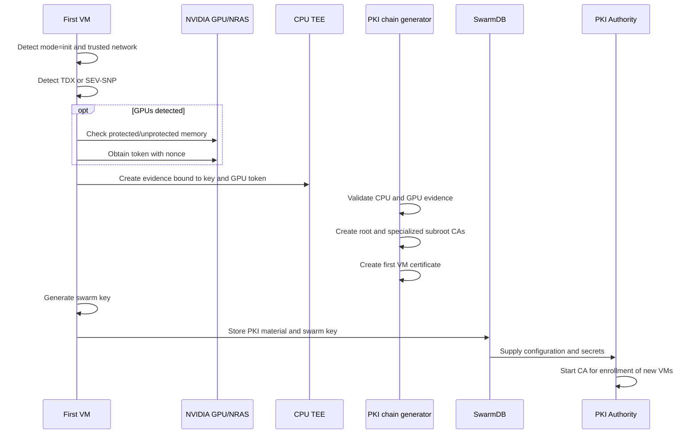

# First Virtual Machine Bootstrap

## Initial State

The first VM starts without existing SwarmDB addresses or a ready PKI:

```yaml
swarm_db:
  join_addresses: []

pki_authority:
  caBundle: ""
  servers: []
```

All three values must be empty at the same time. The detector writes the
`init` mode to `/etc/swarm/swarm-vm-mode`.

## Sequence



## 1. Detecting the Hardware Environment

The CPU TEE type is detected automatically:

- `/dev/tdx_guest` identifies Intel TDX;
- `/dev/sev-guest` identifies AMD SEV-SNP;
- the absence of a supported device stops attestation.

The detected CPU type is written to `/etc/swarm/swarm-cpu-type`.

## 2. Creating Keys and the Challenge

When the VM has GPUs, NVIDIA verification runs before CPU evidence is created:

1. GPUs exposing unprotected memory are rejected;
2. a random nonce is generated;
3. an NVIDIA token is obtained;
4. SHA-256 is calculated over the serialized NVIDIA token;
5. the public-key hash and token hash are combined in CPU `reportData`.

The CPU quote/report therefore attests the VM environment, certificate key,
and the specific GPU token together.

## 3. Local Evidence Verification

The generator does not place an unchecked challenge into a certificate:

- for TDX, it verifies the DCAP quote and event-log integrity;
- for SEV-SNP, it verifies the report and platform policy and then reproduces
  the launch measurement;
- when a GPU is present, it verifies token binding, NVIDIA policy, and
  `dbgStat`;
- the first 32 bytes of verified `reportData` must match the public key of the
  certificate being created.

An independent PKI Authority does not exist yet, so the local generator does
not use the trusted `mrEnclave` registry as an external admission gate. The
first VM image becomes verifiable by joining nodes after its measurement is
published in the trusted registry. Joining nodes calculate `mrEnclave` from
the root CA evidence and must find the value in the registry before enrollment.

## 4. Creating the PKI

A root CA and two specialized subroot CAs are created:

- device enrollment;
- evidence signing.

A first-VM certificate signed by the device subroot is also created. The full
hierarchy and certificate lifetimes are described in the
[PKI chapter](06-pki.md).

The root certificate contains:

- the challenge type;
- `networkType=trusted`;
- serialized CPU TEE evidence.

The first-VM certificate also contains the challenge ID, CPU evidence, the
validation marker, and verified GPU information when a GPU is present.

## 5. Creating and Storing the `swarm key`

The first VM generates one random 32-byte value, represented by 64 hexadecimal
characters. The file:

```text
/etc/swarm/swarm.key
```

is created with mode `0600` and is not overwritten.

After local SwarmDB starts, the bootstrap procedure stores:

- root and subroot certificates;
- their private keys;
- the PKI management token;
- the `swarm key`;
- the evidence-signing key.

PKI material is stored as `SwarmSecrets`. After a successful import, the
temporary `/etc/super/certs/swarm-init` directory is removed to avoid retaining
a second copy of private keys.

## 6. Starting the PKI Authority

The provisioning component obtains secrets from replicated state, writes them
to PKI Authority persistent storage, and creates a configuration containing:

- `networkType: trusted`;
- a unique `networkID`;
- allowed `tdx`, `tdx-google`, and `sev-snp` challenges;
- reference measurement verification through the trusted registry;
- the `swarmKey` issued to attested nodes;
- an HTTPS endpoint on port `9443`.

After startup, the PKI Authority on the first VM becomes the enrollment point
for new nodes. Its addresses and CA bundle must be passed to joining VMs
together with the existing SwarmDB addresses.

## Bootstrap Result

Bootstrap is complete when the following exist:

- a trusted-network root CA containing CPU TEE evidence;
- device and evidence subroot CAs;
- a validated first-VM certificate;
- the `swarm key`;
- a running PKI Authority;
- SwarmDB containing PKI secrets and network state.
