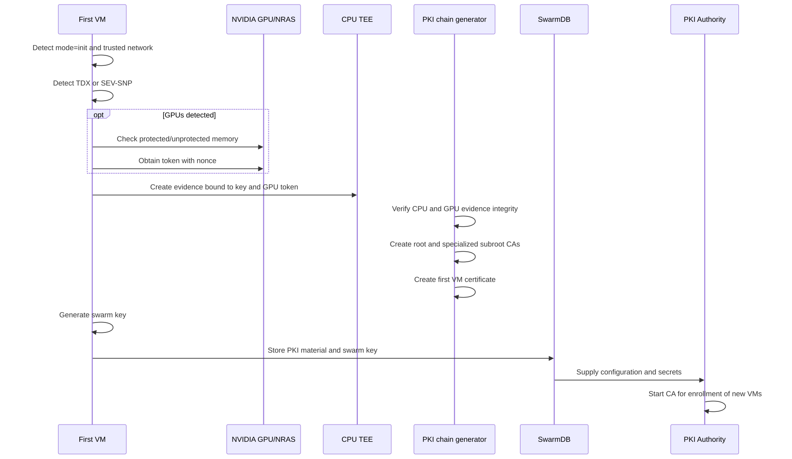

# 2. First Virtual Machine Bootstrap

## Initial State

The first VM starts in `init` mode and initializes SwarmDB and the PKI
infrastructure for a new Swarm.

To select this mode, the following fields in `/sp/swarm/config.yaml` must be
empty:

- `swarm_db.join_addresses: []` — no existing SwarmDB nodes;
- `pki_authority.caBundle: ""` — no root CA of an existing Swarm;
- `pki_authority.servers: []` — no existing PKI Authority endpoints.

An omitted field or a field with a `null` value is treated as empty. The
explicit empty values below show the expected field types.

The relevant configuration fragment is:

```yaml
swarm_db:
  join_addresses: []

pki_authority:
  caBundle: ""
  servers: []
```

All three fields must be empty simultaneously. The mode detector then writes
`init` to `/etc/swarm/swarm-vm-mode`.

## Sequence



## 1. Detecting the Hardware Environment

The CPU TEE type is detected by `pki-cert-generator get-attestation-type`, in
this order:

1. An Azure confidential VM is identified first, without any network
   request. Azure CVMs run behind a Microsoft paravisor, so the guest has no
   usable TEE device and `/proc/cpuinfo` carries no TEE flags. Instead:
   - the DMI chassis asset tag
     (`/sys/class/dmi/id/chassis_asset_tag`) equals
     `7783-7084-3265-9085-8269-3286-77`, which marks an Azure VM;
   - the Hyper-V isolation type (CPUID leaf `0x4000000C`, `EBX & 0xF`, read
     through `/dev/cpu/0/cpuid` after checking the `Microsoft Hv` signature
     at leaf `0x40000000`) names the TEE: `3` is TDX, `2` is SEV-SNP. This is
     the value the Linux kernel itself uses.

   Isolation type TDX selects `tdx-azure`, SEV-SNP selects `sev-snp-azure`.
   This check runs before the device checks because on Azure the isolation
   type takes precedence over any `/dev/sev-guest`.
2. Character device `/dev/tdx_guest` identifies Intel TDX. A Google IMDS
   request to `http://169.254.169.254/computeMetadata/v1/instance/id` with
   header `Metadata-Flavor: Google` and a 500 ms timeout selects
   `tdx-google` when it returns a non-empty instance ID; otherwise the type
   is `tdx`.
3. Character device `/dev/sev-guest` identifies AMD SEV-SNP (`sev-snp`). On
   GCP, detected by the same IMDS request, SEV-SNP is not supported and the
   type is `untrusted`.
4. Otherwise the type is `untrusted`, and no certificate for a trusted network
   can be issued.

`tdx-azure` and `sev-snp-azure` are not aliases of `tdx-google` or `sev-snp`.
Azure evidence is produced through the vTPM rather than a TEE guest driver;
its format and verification are described in
[chapter 8](08-azure-attestation.md).

The detected CPU type is written to `/etc/swarm/swarm-cpu-type`.

## 2. Creating Keys and the Challenge

When the VM has GPUs, GPU evidence is prepared before CPU evidence is created:

1. GPUs exposing unprotected memory are rejected;
2. a random nonce is generated;
3. an NVIDIA token is obtained;
4. SHA-256 is calculated over the serialized NVIDIA token;
5. the public-key hash and token hash are combined in CPU `reportData`.

The CPU quote/report therefore attests the VM environment, certificate key,
and the specific GPU token together.

## 3. Local Evidence Verification

Before creating the certificates, the generator verifies the hardware
evidence:

- for TDX (`tdx`, `tdx-google`), it verifies the DCAP quote and event-log
  integrity;
- for Azure (`tdx-azure`, `sev-snp-azure`), it verifies the vTPM evidence and
  the Microsoft Azure Attestation verdict as described in
  [chapter 8](08-azure-attestation.md);
- for SEV-SNP, it verifies report authenticity and the required platform
  security properties, and reproduces the launch measurement;
- when a GPU is present, it verifies token binding, the NVIDIA verification
  results, and the absence of debug mode;
- the public-key hash in the verified `reportData` must match the key of the
  certificate being created.

This local verification confirms the cryptographic correctness and hardware
integrity of the reports. It does not compare the first VM's `mrEnclave` with
the trusted registry. Joining nodes perform that registry check later, before
accepting the root CA.

## 4. Creating the PKI

A root CA and two specialized subroot CAs are created:

- device enrollment;
- evidence signing.

A first-VM certificate signed by the device subroot is also created. The full
hierarchy is described in the [PKI chapter](06-pki.md).

The root certificate contains:

- the challenge type;
- `networkType=trusted`;
- serialized CPU TEE evidence.

The first-VM certificate also contains the challenge metadata and CPU evidence,
as well as verified GPU information when a GPU is present.

The certificate fields and their OIDs are described in
[Certificate Extensions and OIDs](06-pki.md#certificate-extensions-and-oids).

## 5. Creating and Storing the `swarm key`

The first VM generates one random 32-byte value, represented by 64 hexadecimal
characters. The file:

```text
/etc/swarm/swarm.key
```

is created with mode `0600` and is not overwritten.

After local SwarmDB starts, the bootstrap procedure stores:

- root and subroot certificates;
- their private keys;
- the `swarm key`;
- the evidence-signing key.

PKI material is stored as `SwarmSecrets`. After a successful import,
`/etc/super/certs/swarm-init` is removed.

## 6. Starting the PKI Authority

When PKI Authority starts, it obtains the PKI material and `swarmKey` from
`SwarmSecrets` and reads its settings from `/sp/swarm/config.yaml`:

- `networkType: trusted`;
- `networkID` from `pki_authority.networkID`;
- allowed attested device types: `tdx`, `tdx-google`, `tdx-azure`, `sev-snp`,
  and `sev-snp-azure`.

`networkID` is not a secret. It identifies the Swarm in the PKI enrollment
protocol and prevents two clusters from being mixed accidentally. The value is
provided through the configuration and must be the same on every VM in that
Swarm; PKI Authority does not generate it. A challenge carrying a different
`networkID` is not accepted.

PKI Authority exposes its HTTPS endpoint on port `9443`. Its TLS configuration
and root CA retrieval are described in
[PKI Endpoint](06-pki.md#pki-endpoint).

After startup, the PKI Authority on the first VM becomes the enrollment point
for new nodes. Its addresses and CA bundle must be passed to joining VMs
together with the existing SwarmDB addresses.

## Bootstrap Result

Bootstrap is complete when the following exist:

- a trusted-network root CA containing CPU TEE evidence;
- device and evidence subroot CAs;
- the `swarm key`;
- SwarmDB containing PKI secrets and network state;
- a running PKI Authority.
