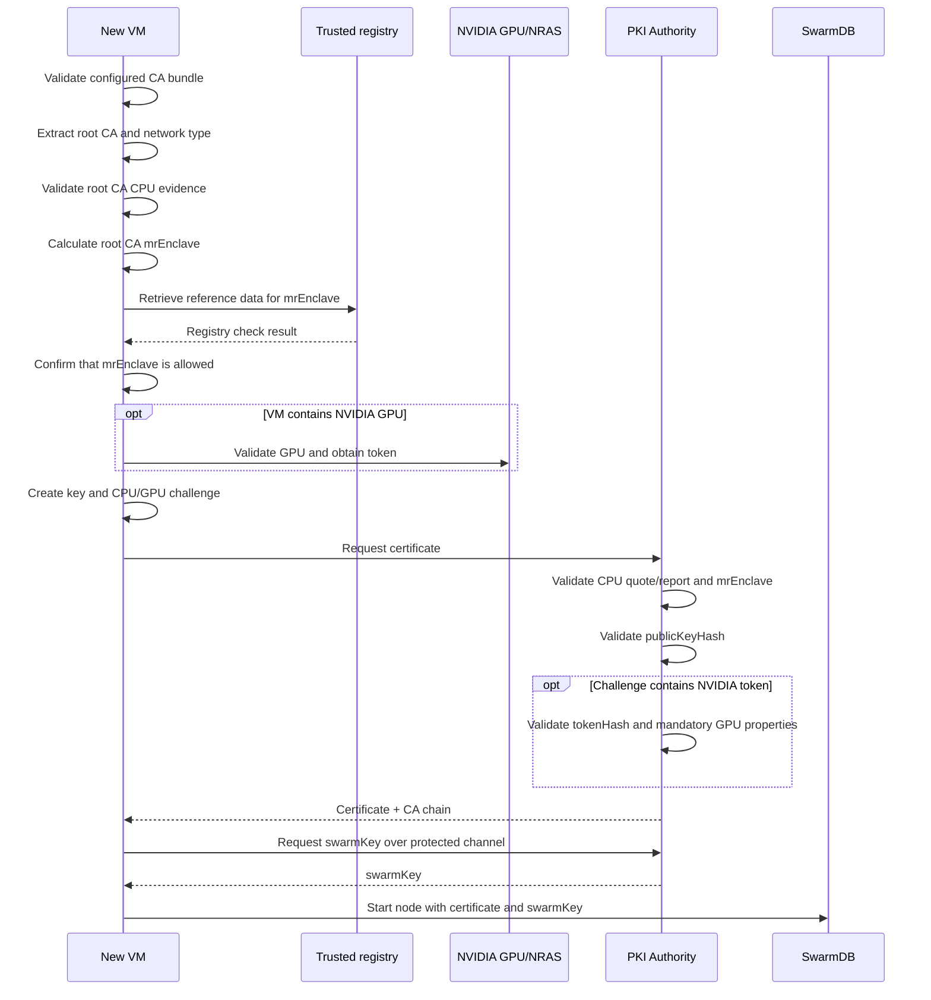

# Joining a Subsequent Virtual Machine

## Input

A joining VM must receive a consistent set of parameters:

```yaml
swarm_db:
  join_addresses:
    - "10.0.0.10:3306"

pki_authority:
  caBundle: |
    -----BEGIN CERTIFICATE-----
    ...
    -----END CERTIFICATE-----
  servers:
    - "10.0.0.10:9443"
```

The values illustrate the structure only. Actual addresses and certificates
are supplied by the environment operator. When all three field groups are
populated, the VM selects `normal` mode. SwarmDB addresses are also used as
additional PKI endpoints on port `9443` when their hosts are not already
listed in `pki_authority.servers`.

## Join Sequence



## 1. Root CA Verification Before Enrollment

Exactly one self-signed root is extracted from `caBundle`. The client then
checks that:

1. the network-type extension is present and equals local `trusted`;
2. the root contains CPU TEE evidence;
3. the quote/report signature and manufacturer verification data confirm
   platform authenticity and an acceptable security state;
4. a normalized `mrEnclave` can be calculated from the evidence;
5. the calculated `mrEnclave` is among the values allowed by the trusted
   registry.

This confirms that the configured root CA was created inside an approved
confidential VM. Only then does the client contact the PKI Authority.

After receiving a response, the PKI client compares the cryptographic SHA-256
fingerprint of the returned root certificate with the root from the configured
`caBundle`. This prevents an unnoticed substitution of the trust root.

## 2. Creating the Node Key

The key pair is generated locally. The private key is never sent to the PKI
Authority. The challenge includes the SHA-256 hash of the public key. The
Authority compares it with the first 32 bytes of `reportData` extracted from
the verified CPU quote/report.

This proves possession of the corresponding private key: evidence cannot be
reused to request a certificate for a different key.

## 3. Adding GPU Evidence

Without a GPU, the client creates a CPU-only challenge. When GPUs are detected:

- every display GPU passes the local confidential-memory check;
- an NVIDIA token is obtained with a fresh nonce;
- the token hash is placed in the second half of CPU `reportData`;
- the token itself is sent alongside CPU evidence.

The detailed algorithm is described in the
[NVIDIA GPU chapter](05-nvidia-gpu-attestation.md).

## 4. PKI Authority Checks

The Authority performs one ordered validation sequence:

1. the challenge type is allowed by the trusted-network configuration;
2. the CPU quote/report hardware signature is valid;
3. the TDX event log is consistent or the SEV-SNP launch digest is reproduced;
4. `mrEnclave` is extracted;
5. the public-key hash is verified;
6. `mrEnclave` is among the values allowed by the trusted registry;
7. when an NVIDIA token is present, its hash, mandatory NVIDIA verification
   results, and the absence of debug mode are checked;
8. `networkID` is checked to prevent use of the challenge in another Swarm.

If any mandatory check fails, a certificate carrying the
successful-attestation marker is not issued, so the request cannot be used to
obtain `swarmKey`. Normal trusted-node enrollment requires the entire sequence
to pass.

## 5. Certificate Issuance Result

After successful validation, the PKI Authority issues a VM certificate
containing:

- the challenge type;
- the challenge ID (`mrEnclave`);
- CPU TEE evidence;
- the server-added successful-attestation marker;
- NVIDIA GPU information when GPU evidence was supplied.

The client stores:

```text
/etc/super/certs/vm/vm_key.pem
/etc/super/certs/vm/vm_cert.pem
/etc/super/certs/vm/vm_ca.pem
```

`vm_cert.pem` contains the VM certificate and intermediate certificates;
`vm_ca.pem` contains the root CA.

> Note: in the current implementation, this certificate material is used by
> the PKI sync client to obtain `swarmKey`. After synchronization completes,
> it is not used by other node components.

## 6. Obtaining the `swarm key`

The client calls the PKI Authority secrets API over HTTPS and presents the
issued certificate. Before releasing the secret, the Authority:

1. rejects requests not received over HTTPS;
2. extracts the client certificate chain from the TLS connection;
3. validates the chain signatures and integrity against the current network
   root CA;
4. identifies the VM certificate in the chain and requires its
   successful-attestation marker;
5. requires a non-empty list of requested secrets;
6. obtains `swarmKey` from configured storage and confirms that it exists.

A request without a client certificate, with an invalid chain, or without the
successful-attestation marker is rejected. A TLS connection alone is therefore
insufficient: the secret is available only to a node holding a certificate
issued after successful challenge validation.

The client stores the received `swarmKey` in:

```text
/etc/swarm/swarm.key
```

The SwarmDB configuration is generated afterwards. A system dependency
prevents SwarmDB from starting before PKI synchronization succeeds. A node
without a certificate and `swarm key` therefore cannot join the SwarmDB
cluster through the normal flow.
