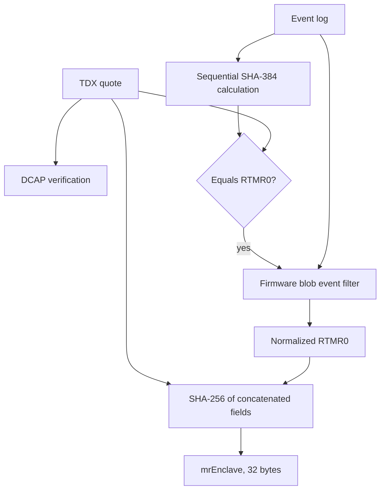
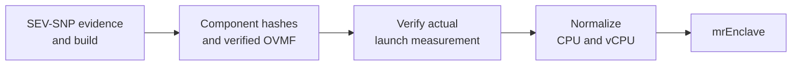

# Intel TDX and AMD SEV-SNP Measurements

## Purpose of `mrEnclave`

TDX and SEV-SNP use different hardware formats. The system converts them to a
32-byte `mrEnclave` identifier that:

- is deterministic for an equivalent trusted configuration;
- can be verified from hardware evidence;
- can be published as a reference value;
- does not depend on vCPU count, RAM size, or GPU presence.

`mrEnclave` is an application-protocol term. It must not be equated with only
TDX `MRTD`, SEV-SNP `MEASUREMENT`, or SGX `MRENCLAVE`.

This independence applies to the final `mrEnclave` calculated by the system. A
single reference value can therefore cover VMs started from the same trusted
build with different vCPU counts, RAM sizes, and with or without GPUs. The
underlying hardware evidence may still contain additional information about a
specific VM instance.

## Measurement API

The measurement API is available at:

```text
GET http://127.0.0.1:9180/v1/getMeasure
GET http://127.0.0.1:9180/api/v1/getMeasure
```

Both paths are equivalent.

The response contains the calculated measurement and the evidence from which it
was obtained:

```json
{
  "type": "<hardware evidence type>",
  "evidence": "<base64>",
  "mrenclaveHex": "<hex>"
}
```

The `type` field identifies the hardware evidence type. The API creates
evidence with a zero-filled 64-byte `reportData`; this evidence is intended for
measuring the running VM. It is not an enrollment challenge, where
`reportData` binds the certificate public key and, when present, the serialized
NVIDIA token.

## Intel TDX

### Input

The following TDX quote fields are used:

| Field | Size |
|---|---:|
| `TDATTRIBUTES` | 8 bytes |
| `MRTD` | 48 bytes |
| `RTMR0` | 48 bytes |
| `RTMR1` | 48 bytes |
| `RTMR2` | 48 bytes |
| `RTMR3` | 48 bytes |
| `REPORTDATA` | 64 bytes |

The evidence also contains the TDX event log. Every event digest used in the
calculation must be a 48-byte SHA-384 value.

### 1. Quote Verification

The DCAP verifier checks the quote signature and the Intel verification data
required to confirm that the quote was produced by a genuine TDX platform with
an acceptable security state.

Attestation continues only when the verifier reports success. An invalid
signature, missing or unusable verification data, an unacceptable platform
security state, or an internal verification error means that trust in the
quote cannot be established. In all such cases, the evidence is rejected.

### 2. Event Log Integrity

The RTMR value is reconstructed starting with 48 zero bytes:

```text
R₀ = 0x00 × 48
Rᵢ = SHA-384(Rᵢ₋₁ || eventDigestᵢ)
```

The fully reconstructed `Rₙ` is compared with quote `RTMR0`. A mismatch means
that the event log does not represent the hardware-attested state.

### 3. RTMR0 Normalization

For the final measurement, RTMR0 is calculated again using only:

```text
EV_EFI_PLATFORM_FIRMWARE_BLOB
EV_EFI_PLATFORM_FIRMWARE_BLOB2
```

All other event types are excluded. This reduces the effect of dynamic boot
events that do not belong to the selected firmware identity.

### 4. Final Formula

All fields are concatenated as binary arrays without text encoding or
delimiters:

```text
mrEnclave = SHA-256(
    TDATTRIBUTES ||
    MRTD ||
    normalizedRTMR0 ||
    RTMR1 ||
    RTMR2 ||
    RTMR3
)
```

The result is 32 bytes, or 64 characters in hexadecimal form.

The vCPU count, RAM size, and GPU presence are not passed to this formula as
separate parameters. In the normal flow, changing these resources does not
change the TDX fields used by `mrEnclave` or the normalized RTMR0 event set.
NVIDIA GPU attestation is performed separately and bound to CPU evidence
through `reportData`; GPU evidence is not part of `mrEnclave`.

### TDX Data Flow



## AMD SEV-SNP

### Report Input

Verification and normalization use:

- the original binary SNP report;
- the hardware `MEASUREMENT` field;
- the build identifier;
- the kernel command-line hash;
- the CPU signature;
- the vCPU count.

### 1. Cryptographic Verification

The SNP report signature is verified using the platform VCEK certificate, AMD
CA chain, and certificate revocation lists (CRLs) provided through AMD KDS. The
verifier builds the chain to an AMD CA and confirms that the certificates
involved in verification have not been revoked. When additional security
requirements are configured, report values are checked against them as well.
For example, a minimum acceptable version of platform components can be
required.

### 2. Obtaining Build Artifacts

The build identifier is included in the supporting fields of SEV-SNP evidence.
When evidence is created, the value is extracted from the running VM kernel
command line. It is not obtained from the trusted measurement registry.

The build identifies the data needed to reproduce the launch measurement:
published kernel and initrd hashes and the matching OVMF image. The kernel and
initrd are not downloaded again; their existing hashes are used. OVMF is
downloaded and its integrity is verified.

### 3. Verifying the Actual Launch Measurement

The SNP launch digest is reproduced from OVMF, component hashes, and the actual
report parameters:

```text
expectedMeasure = ComputeLaunchDigest(
    OVMF,
    kernelHash,
    initrdHash,
    cmdLineHash,
    report.cpuSig,
    report.cores
)
```

The result is compared with the hardware `MEASUREMENT` in the report. A
mismatch stops attestation. The build identifier alone is therefore not proof:
the report contents must be reproducible from the published artifacts.

### 4. Normalization

After the actual VM is verified, the launch digest is recalculated for a
canonical configuration:

| Parameter | Normalized value |
|---|---|
| CPU | AMD EPYC Milan, family 25, model 1, stepping 1 |
| vCPU count | `1` |

The CPU signature is constructed from family, model, and stepping according to
CPUID encoding.

```text
singleCoreMeasure = ComputeLaunchDigest(
    OVMF,
    kernelHash,
    initrdHash,
    cmdLineHash,
    MILAN_CPU_SIGNATURE,
    1
)
```

The final normalized 32-byte `mrEnclave` is derived from
`singleCoreMeasure`.

The actual CPU signature and vCPU count are used only to verify that the SNP
report `MEASUREMENT` corresponds to the running VM. They are replaced with
canonical values in the final `mrEnclave`. RAM size and GPU presence are not
inputs to `ComputeLaunchDigest` or the final formula. The normalized SEV-SNP
`mrEnclave` therefore does not depend on vCPU count, RAM size, or GPU presence.

### SEV-SNP Data Flow



## Conditions That Reject the Measurement

- invalid quote/report hardware signature;
- the TDX event log does not reproduce `RTMR0`;
- a measurement field has an invalid size;
- the SEV-SNP build is unknown or unavailable;
- required build data or artifacts are unavailable;
- OVMF integrity verification fails;
- the SEV-SNP launch digest does not match the report;
- the calculated `mrEnclave` is absent from the trusted registry.
