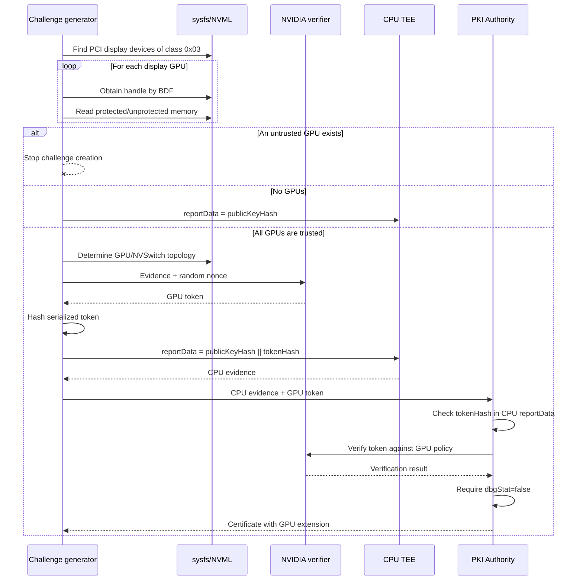

# NVIDIA GPU Attestation

## Role of GPU Attestation

The CPU TEE protects VM memory and execution but does not prove the state of an
attached accelerator. NVIDIA GPUs undergo a separate verification process. Its
result is bound to the CPU quote/report so that the certificate describes one
consistent combination of CPU TEE, node key, and GPU.

GPU verification is performed for TDX, cloud TDX, and SEV-SNP challenges. If no
GPU is present, CPU-only attestation remains valid.

## Complete Flow



## Preliminary Detection of Untrusted GPUs

### Device Discovery

Verification begins by enumerating PCI devices through sysfs, rather than by
reading NVIDIA topology. Every device whose class code begins with:

```text
0x03
```

is selected as a PCI display controller. Diagnostics identify each device as:

```text
<PCI BDF> (<display name>)
```

### Confidential Memory Check

For every device:

1. an NVIDIA handle is requested from NVML by PCI BDF;
2. confidential-compute memory information is requested;
3. both mandatory conditions are applied:

```text
protectedMemSizeKib > 0
unprotectedMemSizeKib == 0
```

A GPU is classified as untrusted when:

- NVML initialization fails;
- no handle can be obtained;
- confidential-memory information cannot be read;
- protected memory has zero size;
- at least one KiB of unprotected memory is available.

Every display GPU is checked. Errors are collected together with their BDF.
Any error raises `UntrustedGpusError` and stops challenge creation. This also
applies when one invalid GPU is present alongside several valid GPUs.

If there are no PCI display devices, the preliminary check succeeds and no
NVIDIA token is created.

## Obtaining the NVIDIA Token

After the preliminary check passes, the topology is determined:

```text
gpuCount
nvswitchCount
```

If `gpuCount == 0`, GPU attestation is skipped. Otherwise:

1. a cryptographically random 32-byte nonce is generated and represented by
   64 hexadecimal characters;
2. the NVIDIA SDK collects GPU evidence;
3. evidence is sent to the remote GPU verifier;
4. the request uses `ppcieMode=false`;
5. an NVIDIA token is returned.

The current structure supports:

```text
nvidiaTokens.gpuToken
nvidiaTokens.nvswitchToken (optional)
```

The implemented flow creates only `gpuToken`. The NVSwitch count is represented
in topology, but a separate NVSwitch token is not requested.

## Binding to the CPU TEE

### Calculating the Hash

The hash is calculated over the serialized NVIDIA token:

```text
tokenHash = SHA-256(serialized NVIDIA token)
```

### Creating `reportData`

```text
baseUserData = SHA-256(publicKeyPem)              // 32 bytes
tokenHash    = SHA-256(serialized NVIDIA token)   // 32 bytes

reportData = baseUserData || tokenHash            // 64 bytes
```

The value is passed to the TDX quote generator or SEV-SNP report generator. If
the final value exceeds 64 bytes, the challenge is not created.

### Verifying the Binding

After CPU evidence verification, the PKI Authority obtains verified
`userData`:

```text
userData[0..31]  = expected public-key hash
userData[32..63] = expected NVIDIA-token hash
```

The Authority serializes the supplied token object again, calculates SHA-256,
and compares it with the second half of `userData`. The first half is then
compared with the public key in the certificate request.

## NVIDIA Verification Policy

The NVIDIA verifier checks the token as a GPU device. The built-in policy
requires, among other conditions:

- `x-nvidia-overall-att-result = true`;
- claims version `3.0`;
- successful measurement results;
- successful parsing of the GPU attestation report;
- matching nonce;
- a valid attestation-report signature;
- a valid certificate chain and good OCSP status;
- matching firmware identity;
- successful retrieval, schema validation, and signature verification of the
  driver RIM;
- a matching driver RIM version;
- available driver measurements;
- successful retrieval, schema validation, and signature verification of the
  VBIOS RIM;
- a matching VBIOS RIM version;
- available VBIOS measurements;
- no conflicting VBIOS index.

A `success=false` result or verifier error blocks certificate issuance.

## Debug-Enabled GPU Rejection

After cryptographic token verification, the following values are extracted
from remote GPU claims:

- `hwmodel`;
- NVIDIA driver version;
- VBIOS version;
- `dbgstat`.

The trusted network applies an additional rule:

```text
for every GPU: dbgstat == "disabled"
```

Any other value is converted to `dbgStat=true`. If debug mode is enabled on
even one GPU, the challenge is rejected.

## Recording the Result in the Certificate

The following structure is created for every verified GPU:

```text
model
driverVersion
vbios
dbgStat
```

The GPU list is encoded as a protobuf message and added to the certificate
under:

```text
OID 1.3.6.1.3.8888.1.4.1
```

The extension is created by the PKI component. A client-supplied extension
with the same OID is discarded. If no NVIDIA token is present, the GPU
extension is omitted.

## Decision Table

| State | NVIDIA token | Enrollment result |
|---|---:|---|
| No GPUs | No | Continue with CPU-only attestation. |
| Every GPU uses protected memory exclusively | Yes | Verify the token and continue. |
| `protectedMemSizeKib == 0` | No | Stop: untrusted GPU. |
| `unprotectedMemSizeKib != 0` | No | Stop: untrusted GPU. |
| NVML, handle, or memory query fails | No | Stop: GPU trust cannot be established. |
| NVIDIA token fails policy | Yes | Reject the certificate request. |
| Token hash does not match CPU `reportData` | Yes | Reject: CPU and GPU evidence are not bound. |
| One GPU has `dbgStat=true` | Yes | Reject the entire VM. |
| Multiple GPUs, one untrusted | No | Stop the entire attestation. |
| NVSwitch is present | GPU token only | Topology is recorded; a separate switch token is not verified. |
