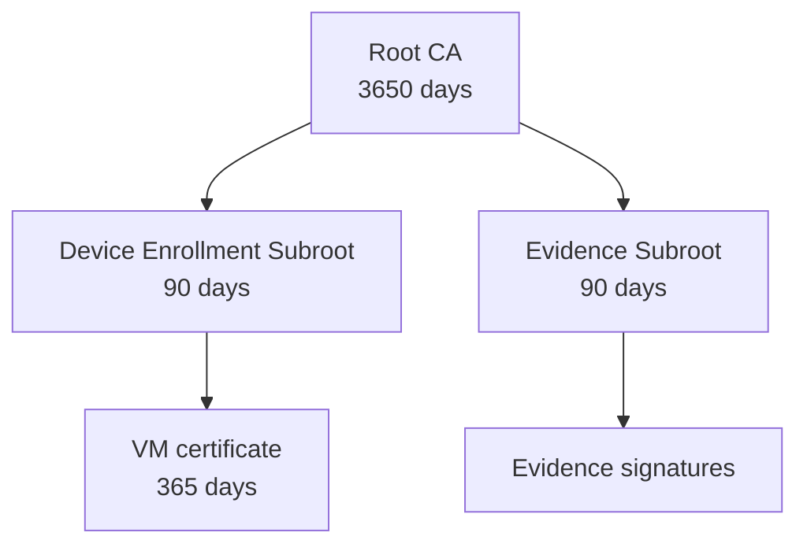
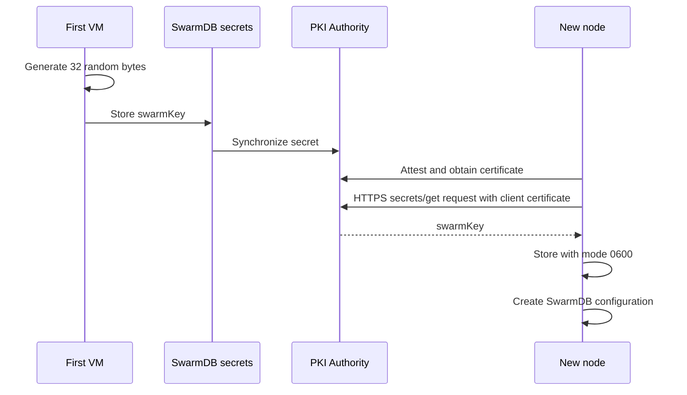

# PKI Architecture

## Purpose

The PKI converts hardware-attestation results into a persistent network
identity. A certificate confirms that its private key was bound to a
successfully verified CPU/GPU challenge. The `swarm key` is released only to
this identity.

## Certificate Hierarchy



The device subroot separates node enrollment from evidence signing.
Compromising the key for one role must not automatically grant the permissions
of the other.

## Root CA

The root CA is created on the first VM using a hardware challenge.

The root certificate is self-signed and contains:

| Extension | Purpose |
|---|---|
| Challenge type | `tdx`, `tdx-google`, or `sev-snp`. |
| Network type | `trusted`. |
| TEE evidence | Serialized CPU quote/report of the first VM. |

TEE evidence is bound to the root public key through `reportData`, because the
challenge is created from the SHA-256 hash of that key. The root is therefore
both the cryptographic PKI root and an attested object.

## VM Certificate

During enrollment, the Authority issues an end-entity certificate. System
extensions are created only by the server:

| OID | Contents |
|---|---|
| `1.3.6.1.3.8888.1.1` | Challenge type. |
| `1.3.6.1.3.8888.1.2` | Verified challenge ID; for a CPU TEE, the normalized `mrEnclave`. |
| `1.3.6.1.3.8888.1.4.1` | Protobuf list of verified NVIDIA GPUs. |
| `1.3.6.1.3.8888.1.6` | Empty extension marking successful validation. |
| `0.6.9.42.840.113741.1337.6` | Serialized CPU TEE evidence. |
| `1.3.6.1.3.8888.4` | Network type, primarily on the root CA. |

A client cannot replace system OIDs through `clientExtensionAttrs`; values
using system prefixes are filtered before certificate issuance.

## Evidence in the Certificate

The VM certificate contains CPU TEE evidence. GPU metadata is stored in a
separate compact protobuf extension.

## Storage on the First VM

### During Bootstrap

The generator writes material to:

```text
/etc/super/certs/swarm-init/
```

The directory contains the certificates and private keys for the root CA,
device-enrollment subroot, and evidence subroot.

Private keys are created with mode `0600`.

### After SwarmDB Starts

Bootstrap transfers the root and subroot certificates and private keys, the
PKI management token, and the evidence-signing key to `SwarmSecrets`.

After a successful transfer, `/etc/super/certs/swarm-init` is removed.

### PKI Authority Persistent Storage

PKI Authority provisioning synchronizes the required `SwarmSecrets` to:

```text
/etc/pki-authority/swarm-storage/
```

The directory is mounted into the Authority container as persistent storage.
The application configuration is stored at:

```text
/etc/pki-authority/app-config.yaml
```

## Storage on a Joining VM

The PKI sync client stores its certificate chain in:

```text
/etc/super/certs/vm/
```

With the `vm` prefix, the following files are used:

| File | Contents |
|---|---|
| `vm_key.pem` | Leaf-certificate private key, mode `0600`. |
| `vm_cert.pem` | Leaf and intermediate certificates. |
| `vm_ca.pem` | Root CA. |

> Note: in the current implementation, the stored `vm_cert.pem` is not used
> by other node components after the `swarm key` has been obtained.

The `swarm key` is stored separately:

```text
/etc/swarm/swarm.key
```

## `swarm key` Distribution



The secret is not transferred before certificate issuance. SwarmDB uses it as
a static symmetric value protecting inter-node communication.

## PKI Endpoint

The Authority listens for HTTPS connections on `0.0.0.0:9443`.

A joining VM builds its HTTPS endpoint list from `pki_authority.servers` and
the hosts in `swarm_db.join_addresses`.

## Trust Lifecycle

1. The root CA is created inside the attested first VM.
2. Every joining node verifies its CPU evidence.
3. The Authority verifies each new node and issues a leaf certificate.
4. The certificate grants access to the network secret.
5. All nodes store the same root CA and `swarm key`, while retaining distinct
   leaf keys and certificates.
