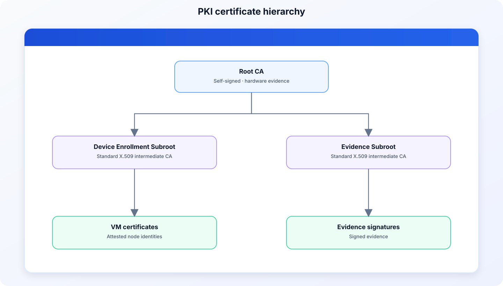

# PKI Architecture

## Purpose

The PKI converts hardware-attestation results into a persistent network
identity. A certificate confirms that its private key was bound to a
successfully verified CPU/GPU challenge. The `swarm key` is released only to
this identity.

## Certificate Hierarchy


<!-- Mermaid source: assets/mermaid/pki-hierarchy.mmd -->

The subroot CAs are intermediate certificate authorities with distinct roles.
The Device Enrollment Subroot issues node certificates, while the Evidence
Subroot signs evidence. Compromising the key for one role must not
automatically grant the permissions of the other.

Subroot certificates contain no attestation-specific fields and are standard
X.509 intermediate CA certificates.

## Root CA

The root CA is created on the first VM using a hardware challenge.

The root certificate is self-signed and contains:

| Extension | Purpose |
|---|---|
| Challenge type | `tdx`, `tdx-google`, or `sev-snp`. |
| Network type | `trusted`. |
| TEE evidence | Serialized CPU quote/report of the first VM. |

The corresponding OIDs are listed in
[Certificate Extensions and OIDs](#certificate-extensions-and-oids).

TEE evidence is bound to the root public key through `reportData`, because the
challenge is created from the SHA-256 hash of that key. The root is therefore
both the cryptographic PKI root and an attested object.

## Certificate Extensions and OIDs

During enrollment, the Authority issues a certificate for the specific VM.
This certificate is not a certificate authority. System extensions are
created only by the server:

| OID | Contents |
|---|---|
| `1.3.6.1.3.8888.1.1` | Challenge type. |
| `1.3.6.1.3.8888.1.2` | Verified challenge ID; for a CPU TEE, the normalized `mrEnclave`. |
| `1.3.6.1.3.8888.1.4.1` | Verified NVIDIA GPU information. [Extension contents and format](05-nvidia-gpu-attestation.md#recording-the-result-in-the-certificate). |
| `1.3.6.1.3.8888.1.6` | Empty extension added by the server to mark successful attestation. |
| `0.6.9.42.840.113741.1337.6` | Serialized CPU TEE evidence. |
| `1.3.6.1.3.8888.4` | Root CA network type; contains `trusted` for a trusted network. |

A client cannot supply or replace these system extensions. The PKI Authority
creates their values exclusively from the verified challenge.

## Evidence in the Certificate

The VM certificate contains CPU TEE evidence. Verified GPU information is
stored in a separate compact Protobuf extension.

## PKI Endpoint

The Authority listens for HTTPS connections on `0.0.0.0:9443`.

For TLS, the service uses the Device Enrollment Subroot certificate and its
corresponding private key. The certificate is signed by the Swarm root CA. All
`pki-authority` instances obtain this PKI material from the shared Swarm
secrets.

The Swarm root certificate is externally available at:

```text
https://<Swarm VM IP address>:9443/api/v1/pki/certs/ca
```

`pki-authority` runs on every Swarm VM, so the certificate can be retrieved
from any reachable VM. Retrieving the root CA over HTTPS does not establish
trust in it: the PKI Authority TLS certificate is signed by that same root CA.
The joining VM therefore verifies the root CA's embedded CPU
[evidence extension](#certificate-extensions-and-oids) and `mrEnclave`
separately.

A joining VM builds its HTTPS endpoint list from `pki_authority.servers` and
the node addresses in `swarm_db.join_addresses`.

Before connecting, the sync client validates the root CA configured in
`pki_authority.caBundle`. This is the only root CA trusted for TLS; system root
certificates are not used. The TLS handshake verifies the presented certificate
signature and chain against the configured root CA. Matching the server IP
address or name against the certificate is disabled. After the VM certificate
is issued, the client additionally checks that the root CA in the returned
chain matches the configured root CA. The `swarmKey` request uses the issued VM
certificate.

## Trust Lifecycle

1. The root CA is created inside the attested first VM.
2. Every joining node verifies its CPU evidence.
3. The Authority verifies each new node and issues an individual VM certificate.
4. The certificate grants access to the network secret.
5. All nodes store the same root CA and `swarm key`, while retaining their own
   VM keys and certificates.
