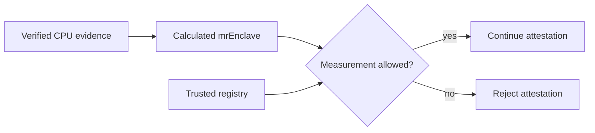

# Reference Measurements

## Purpose of the Registry

The trusted registry contains `mrEnclave` values allowed for use in the
trusted network. It complements hardware evidence verification:

- the hardware verifier confirms the authenticity and validity of CPU
  evidence;
- the registry check confirms that the calculated `mrEnclave` represents an
  approved VM state.

The registry is currently hosted on GitHub. SuperProtocol controls the
addition and publication of reference measurements. Its internal organization
is not part of the attestation protocol.

## Measurement Verification

The verifying party:

1. validates the hardware evidence;
2. calculates a normalized `mrEnclave` according to the applicable hardware
   evidence type;
3. obtains reference data from the trusted registry;
4. confirms that the calculated `mrEnclave` is among the allowed values.

Attestation fails when the corresponding value is absent or the registry is
unavailable.

The Intel TDX and AMD SEV-SNP `mrEnclave` calculation algorithms are described
in the [VM measurements chapter](04-vm-measurements.md).
