# 8. Azure Confidential VM Attestation

## Scope and Status

This chapter describes the attestation of VMs running as Azure confidential
VMs (CVMs) on Intel TDX and AMD SEV-SNP: the evidence format, how it is
produced inside the VM, how it is verified outside Azure, and how `mrEnclave`
is calculated from it.

The mechanism is implemented in `sp-nodejs-addons`
(`attestation-common`, `attestation-wasm`, `tee-addon`). The PKI components of
this image (`pki-cert-generator`, `pki-sync-client`, PKI Authority) use it for
the challenge types `tdx-azure` and `sev-snp-azure`, and the Measurement API
(`pki-vm-measurements`) returns the same evidence and `mrEnclave`.

The design goals are:

- evidence is public and can be verified anywhere, without Microsoft Azure
  Attestation (MAA) tokens stored in it and without Intel Trust Authority;
- evidence cannot be replayed: it is bound to the public key of the node;
- `mrEnclave` covers the whole boot chain of the image but not the VM size,
  the CPU model or the Microsoft paravisor version.

## Platform Model

An Azure CVM does not run the guest directly in the TEE. A Microsoft
paravisor (OpenHCL) runs inside the TD or SEV-SNP VM at the highest privilege
level and hosts the guest OS. The consequences for attestation are:

| Property | Azure CVM | Bare-metal TDX / QEMU |
|---|---|---|
| Hardware report request | only through the paravisor; no `/dev/tdx_guest`, no `/dev/sev-guest` in the guest | guest driver |
| TDX `RTMR0`–`RTMR3` | always zero; no CCEL table | boot measurements |
| TDX `MRTD` / SEV-SNP `MEASUREMENT` | measurement of the Microsoft paravisor | measurement of the guest firmware |
| Guest boot measurements | PCRs of a vTPM provided by the paravisor | RTMRs / launch digest |

The paravisor generates the hardware report (a TDX TDREPORT or a SEV-SNP
attestation report) and publishes it, together with its own data, in the vTPM
as the **HCL report**. Its `report_data` is the SHA-256 of that data, which
names the vTPM attestation key. The guest boot is measured into the vTPM PCRs.
Attestation therefore chains the hardware report to the vTPM, and the vTPM to
the boot chain.


<!-- Mermaid source: assets/mermaid/azure-cvm-chain.mmd -->

The same chain in text form:

```text
Intel / AMD ─signs─► TD quote / SEV-SNP report
                        │ report_data = SHA-256(runtime data) ‖ 0³²
                        ▼
                     HCL runtime data: HCLAkPub, vm-configuration, user-data
                        │                                      │
Microsoft ─certifies─► AK certificate (key == HCLAkPub)        user-data = userData
                        │ signs
                        ▼
                     TPM quote: PCR4, PCR9 digest, SHA-256(userData)
                        ▲ replay
                     event log (PCR4 and PCR9 events)
```

## vTPM Objects

| Object | Handle | Contents |
|---|---|---|
| HCL report | NV `0x01400001` | hardware report + runtime data JSON (see below) |
| HCL user-data | NV `0x01400002` | 64 bytes written by the guest; copied into the runtime data |
| AK certificate | NV `0x01C101D0` | X.509 certificate of the attestation key, issued by Microsoft |
| Attestation key (AK) | persistent `0x81000003` | RSA-2048 signing key; its public part is `HCLAkPub` |

### HCL Report Layout

| Offset | Size | Contents |
|---:|---:|---|
| 0 | 32 | header: `HCLA`, version 2, report size, request type, status |
| 32 | 1184 | hardware report area: a SEV-SNP report fills it, a TDX TDREPORT uses the first 1024 bytes |
| 1216 | 20 | runtime data header: data size, version, **report type** (2 = SEV-SNP, 4 = TDX), hash type (1 = SHA-256), length |
| 1236 | variable | runtime data JSON |

The NV index is larger than the report; bytes after the report size are
zero padding.

The runtime data JSON contains:

| Key | Contents |
|---|---|
| `keys` | JWKs `HCLAkPub` (the AK) and `HCLEkPub` (the endorsement key) |
| `vm-configuration` | VM settings: `secure-boot`, `tpm-enabled`, `console-enabled`, `vmUniqueId`, and on TDX also `interactive-console-enabled`, `filtered-vpci-devices-allowed` |
| `user-data` | hex of the 64-byte HCL user-data |

The hardware report binds the runtime data:

```text
report_data = SHA-256(runtime data JSON) || 32 zero bytes
```

`report_data` is at offset 128 of the TDREPORT and at offset `0x50` of the
SEV-SNP report.

## Binding userData

`userData` is up to 64 bytes, typically the hash of the node's public key. It
is bound twice:

1. **Into the hardware report.** The guest writes `userData`, zero-padded to
   64 bytes, to NV `0x01400002`. The paravisor then reissues the HCL report
   with it in `user-data`, and thus in `report_data`. The index must be
   defined with the attributes `OwnerWrite | OwnerRead` (`0x00020002`); with
   other attributes the paravisor ignores it. The report is reissued
   asynchronously, usually within 0–4 seconds, so the generator polls
   `0x01400001` until `user-data` matches.
2. **Into the TPM quote.** `TPM2_Quote` is called with
   `qualifyingData = SHA-256(userData64)`. The vTPM accepts at most 50 bytes of
   qualifying data, so the 64 bytes themselves cannot be used.

The verifier returns the 64-byte HCL `user-data` as `reportData`, with the
same meaning as for the other TEE types. In a PKI challenge it is the SHA-256
of the certificate's DER-encoded public key (`SubjectPublicKeyInfo`) followed,
on a VM with NVIDIA Confidential Computing GPUs such as
`Standard_NCC40ads_H100_v5`, by the SHA-256 of the NVIDIA token, exactly as in
[chapter 5](05-nvidia-gpu-attestation.md#creating-reportdata).

Evidence is public. It cannot be reused by another party because only the
holder of the private key matching `reportData` can complete the protocol that
follows attestation (TLS or a signed challenge). The relying party must
therefore always require proof of possession of that key and compare all 64
bytes of `reportData` with the expected hash.

## Evidence

Two evidence types are defined in the DTO (`sp-dto`):

| Type | Value | Message |
|---|---:|---|
| `TEE_EVIDENCE_TYPE_INTEL_TDX_AZURE` | 4 | `IntelTDXAzureEvidence` |
| `TEE_EVIDENCE_TYPE_AMD_SEV_SNP_AZURE` | 5 | `AmdSevSnpAzureEvidence` |

| Field | TDX | SEV-SNP |
|---|---|---|
| `hclReport` | NV `0x01400001` with the TDREPORT | NV `0x01400001` with the SEV-SNP report |
| `quote` | TD quote for that TDREPORT, from Azure IMDS `/acc/tdquote` | — (the SEV-SNP report is signed itself) |
| `certs` | — | VCEK, ASK and ARK of the report |
| `tpmAttest` | `TPMS_ATTEST` of `TPM2_Quote`, AK `0x81000003`, SHA-256 PCR4 and PCR9 | same |
| `tpmSignature` | `TPMT_SIGNATURE`, RSASSA / SHA-256 | same |
| `eventLog` | TCG2 crypto-agile log: the Spec ID header and the PCR4 and PCR9 events only | same |
| `akCertChain` | DER: AK certificate, then its intermediate CAs; the root is not included | same |

PCR values are not stored: the verifier recomputes them from `eventLog` and
compares them with the digest signed in `tpmAttest`. A typical evidence is
about 14.7 KB.

### Evidence Generation

`go-tdx-attest-wrapper attest-azure` (called by `AzureCvmService` in
`tee-addon`) produces the evidence inside the VM:

1. Writes `userData` to NV `0x01400002`, creating the index if absent.
2. Reads NV `0x01400001` until the runtime data carries the new `user-data`.
3. Detects the platform from the report type of the HCL report.
4. TDX: requests the TD quote for the TDREPORT from Azure IMDS
   (`POST http://169.254.169.254/acc/tdquote`).
   SEV-SNP: fetches VCEK, ASK and ARK from Azure THIM
   (`http://169.254.169.254/metadata/THIM/amd/certification`); if THIM is
   unavailable, from AMD KDS by the report's chip ID and TCB.
5. Calls `TPM2_Quote` over SHA-256 PCR4 and PCR9 with
   `qualifyingData = SHA-256(userData64)`.
6. Reduces `/sys/kernel/security/tpm0/binary_bios_measurements` to the Spec ID
   header and the PCR4 / PCR9 events.
7. Reads the AK certificate and follows its Authority Information Access
   links to collect the intermediate CAs.
8. Verifies the collected evidence end to end, including that the VCEK signed
   the SEV-SNP report, and fails if `user-data` was changed concurrently.

## Verification

Verification runs outside the VM. Steps 1, 3, 4 and 5 are offline. Step 2
fetches Intel collateral for TDX and, optionally, certificate revocation lists;
step 6 asks MAA.

### 1. HCL Report and Platform

- The HCL report has the `HCLA` header, a consistent size and a SHA-256
  runtime data hash type.
- Its report type matches the evidence type (TDX or SEV-SNP). Otherwise the
  vendor signature checked in step 2 would not cover this report.
- The hardware report's `report_data` equals
  `SHA-256(runtime data) || 32 zero bytes`.

### 2. Vendor Signature

- **TDX.** The TD quote is verified with the Intel PCK certificate chain up to
  the Intel SGX Root CA, with Intel collateral, TCB status and, optionally,
  the CRL. Every body field of the quote (`MRTD`, `TDATTRIBUTES`, `XFAM`,
  `RTMR0`–`RTMR3`, `MRCONFIGID`, `MROWNER`, `MROWNERCONFIG`, SEAM fields and
  `report_data`) must equal the TDREPORT in the HCL report.
- **SEV-SNP.** The report is verified with the VCEK, and VCEK → ASK → ARK is
  verified up to a built-in AMD root (Milan, Genoa, Turin); the VCEK TCB and
  chip ID extensions must match the report; the CRL is optional. Reports
  signed with a VLEK are not supported.

### 3. Attestation Key

- The AK certificate chains to the pinned **Azure Virtual TPM Root
  Certificate Authority 2023** (SHA-256
  `E6:C5:96:B1:7F:8F:FE:FB:A5:C3:00:F7:14:CF:B1:26:0C:60:28:70:4E:CF:7B:EC:C4:AB:50:18:EF:B0:0E:95`,
  valid until 2048). The chain is verified at the certificate's `notBefore`,
  so evidence remains verifiable after the one-year AK certificate expires.
- It has the `tcg-kp-AIKCertificate` EKU (`2.23.133.8.3`) and a
  `*.ConfidentialVM.Azure.windows.net` subject.
- Its public key equals `HCLAkPub` in the runtime data.

### 4. TPM Quote

- `TPMS_ATTEST` is a quote (`TPM_ST_ATTEST_QUOTE`) that selects exactly the
  SHA-256 bank of PCR4 and PCR9.
- It is signed by the AK (RSASSA, SHA-256).
- `extraData` equals `SHA-256(user-data)` from the runtime data.

### 5. Event Log

- The log contains only PCR4 and PCR9 events, each with a SHA-256 digest.
- Replaying them from zero gives PCR4 and PCR9, and
  `SHA-256(PCR4 || PCR9)` equals the `pcrDigest` of the TPM quote.

Event data is not covered by any digest. Only digests are used, except for the
self-describing check in the `mrEnclave` normalization below.

### 6. Genuine Azure Paravisor: Microsoft Azure Attestation

Steps 1–5 prove that a genuine TEE produced a report naming a
Microsoft-certified vTPM key, and that this vTPM measured the image. They do
not prove that the code running in the TEE is the genuine Azure paravisor:
only `MRTD` / `MEASUREMENT` identifies it, and Microsoft publishes no reference
values for them. The SEV-SNP ID key digest is not a stable alternative either:
Azure uses several ID keys.

Microsoft Azure Attestation is Microsoft's authority for these measurements.
The verifier sends the public parts of the evidence to MAA; nothing is stored
and no authentication is required:

| Platform | Request |
|---|---|
| TDX | `POST https://<instance>.attest.azure.net/attest/TdxVm?api-version=2023-04-01-preview` with the TD quote and the runtime data |
| SEV-SNP | `POST https://<instance>.attest.azure.net/attest/SevSnpVm?api-version=2022-08-01` with the report, the PEM VCEK chain and the runtime data |

Any shared MAA instance gives an equivalent verdict, because the token checks
below are tied to the instance that was asked. The library default is
`https://sharedeus.eus.attest.azure.net`. The image picks the nearest one
instead: while detecting the VM mode, `pki_configure_helper.py` measures the
latency to the shared instances published by Microsoft, keeps the fastest, and
writes it to `/etc/swarm/swarm-maa-endpoint`; the PKI Authority service passes
it on as `azure.maaEndpoint` and falls back to `sharedeus` without the file.

MAA itself verifies the vendor signature and the runtime data binding (it
rejects altered runtime data). The verifier accepts the answer only if:

- the token is RS256-signed by a key published by the same instance (`jku` =
  `<instance>/certs`), was issued by it (`iss`) and is within its validity
  period;
- `x-ms-attestation-type` is `tdxvm` / `sevsnpvm` as expected;
- it echoes the evidence's `MRTD` (`tdx_mrtd`) or launch measurement
  (`x-ms-sevsnpvm-launchmeasurement`);
- `x-ms-runtime.keys` contains the evidence's `HCLAkPub`.

Any mismatch rejects the evidence. The last check ties MAA's verdict to the
vTPM key that signed the PCRs, which rules out pairing the vTPM of one VM with
the hardware report of another.

The verdict is `azureCompliant`: `true` if and only if MAA stated
`x-ms-compliance-status: azure-compliant-cvm`. A trusted network must require
`azureCompliant: true`.

The MAA endpoint sends no CORS headers. The check works from Node.js and from
browser extensions with host permissions for the endpoint, but not from a web
page.

## `mrEnclave`

### Formula

```text
mrEnclave = SHA-256( vmConfigFlags || PCR4′ || PCR9′ )

vmConfigFlags — one byte (0 or 1) per vm-configuration flag, in this order:
    TDX:     secure-boot, tpm-enabled, console-enabled,
             interactive-console-enabled, filtered-vpci-devices-allowed
    SEV-SNP: secure-boot, tpm-enabled, console-enabled

PCRn′ — SHA-256 extend from 32 zero bytes over the digests of the PCRn events,
        skipping EV_NO_ACTION, and EV_EFI_ACTION / EV_SEPARATOR whose digest
        is SHA-256 of their own event data
```

A missing flag rejects the evidence. The SEV-SNP paravisor does not report the
last two TDX flags, so `mrEnclave` differs between the platforms even for the
same image.

### What It Covers

| Input | Measures |
|---|---|
| PCR4 | Authenticode hashes of the boot applications: the bootloader with its embedded configuration, and the kernel with its embedded initramfs |
| PCR9 | the kernel command line, including the dm-verity root hash, and therefore the root filesystem |
| `vmConfigFlags` | whether Secure Boot, the vTPM and the serial console are enabled |

### What It Excludes

- the VM size (vCPUs, memory, disk) and the CPU model;
- the Microsoft paravisor: `MRTD` / `MEASUREMENT`, PCR0–PCR3, TD attributes,
  SEV-SNP policy — these are verified by MAA and reported separately;
- per-VM data: PCR5 (GPT), PCR6 (`vmUniqueId`);
- informational firmware events around boot applications.

### Normalization Safety

The TCG event type is not covered by any digest, so the type alone is never
trusted. An event is skipped only if its digest is the SHA-256 of its own
data. A measured binary can never satisfy this: its digest is an Authenticode
hash, not the hash of the event data. Relabelling a measured event as
`EV_EFI_ACTION` therefore leaves it in `mrEnclave`.

### Image Requirements

PCR4 and PCR9 cover the boot chain only if no unmeasured code runs before the
kernel. The bootloader must not load code or configuration from disk: the
image uses a standalone GRUB with its configuration and the kernel embedded in
its memdisk and no filesystem modules. Otherwise code loaded from an
unmeasured partition could extend PCR4 / PCR9 with arbitrary values.

### Reference Values

`mrEnclave` changes with every build, and a debug build differs from the
release build of the same number. Measured on `build-445-release` through the
Measurement API:

| Platform | VM size | `mrEnclave` |
|---|---|---|
| Azure TDX | Standard_DC8es_v6 | `3b87e54d9c1759585e0bed03646374f52b39433e8389ff945cd6ed31071dfeb5` |
| Azure SEV-SNP (Milan) | Standard_DC8as_v5 | `1cccb72fb97be3a057f65eccdc4f92e6d2c2b0b17caaa81ed95400927c678ea7` |

One image produces the same PCR4 and PCR9 on both platforms; the two values
differ only because of the flag sets. The VM size does not enter `mrEnclave`:
on `build-442-debug`, `Standard_DC2es_v6` and `Standard_DC4es_v6` gave the
same value.

## Values Left to Policy

The verifier reports these values without enforcing them. The PKI Authority
enforces three of them for `tdx-azure` and `sev-snp-azure` challenges:

- `maa.azureCompliant` must be `true` on every network; the MAA check is always
  on and cannot be disabled, and evidence is rejected when MAA is unreachable;
- a debug VM (`tdDebug` on TDX, `debugAllowed` on SEV-SNP) is accepted only
  when the network type is `untrusted`;
- the calculated `mrEnclave` must be signed in the trusted registry
  ([chapter 7](07-reference-measurements.md)).

| TDX | SEV-SNP | Meaning |
|---|---|---|
| `maa.azureCompliant` | `maa.azureCompliant` | genuine Azure paravisor; must be `true` |
| `tdDebug` | `debugAllowed` | a debug VM offers no confidentiality; must be `false` |
| `mrTd` | `measurement` | paravisor measurement; changes with Microsoft updates |
| — | `vmpl` | VMPL of the report; 0 is the paravisor |
| `tdxTcbStatus`, `qeTcbStatus` | `reportedTcb` | platform TCB: Intel reports a status, AMD only the version |
| `certChainRevocationStatusOk` | `certChainRevocationStatusOk` | set when a CRL check was requested |
| `akCertificate.validNow` | `akCertificate.validNow` | the AK chain is valid today |
| `vmConfiguration` | `vmConfiguration` | settings reported by the paravisor |

## Conditions That Reject Azure Evidence

- the HCL report is malformed or of the other platform;
- `report_data` does not match the runtime data;
- TDX: the TD quote signature or collateral is invalid, or the quote does not
  match the TDREPORT;
- SEV-SNP: the report signature or the AMD chain is invalid
  (`attestationReportIntegrity: false`);
- the AK certificate does not chain to the pinned Microsoft root, lacks the
  AIK EKU or the confidential VM subject, or does not match `HCLAkPub`;
- the TPM quote signature is invalid, it selects other PCRs, or its
  qualifying data does not match `user-data`;
- the event log contains other PCRs or does not reproduce the PCR digest;
- the MAA token is invalid or does not echo the evidence's measurement and
  `HCLAkPub`;
- MAA does not state `azure-compliant-cvm`, the VM is a debug VM, or the
  calculated `mrEnclave` is absent from the trusted registry (policy).

## Lifetime

Evidence carries no timestamp; freshness comes only from `userData`.

| Limit | Duration | After it |
|---|---|---|
| Intel TCB status (fresh collateral on every verification) | months, until the next Intel TCB recovery | `tdxTcbStatus` becomes `OutOfDate`; the owner re-attests |
| AMD reported TCB | until AMD publishes a newer TCB | only the minimum-version policy decides |
| MAA verdict | while Microsoft supports that paravisor version | `azureCompliant: false`; the owner re-attests on an updated VM |
| Certificate revocation (optional CRL) | any time | `certChainRevocationStatusOk: false` |
| Intel PCK chain / AMD VCEK | about 7 years | vendor signature verification fails |
| Microsoft AK certificate (1 year) and its CAs (2029–2048) | does not limit verification | `akCertificate.validNow` turns `false` |

## Trust Anchors

| Anchor | Pinned in | Proves |
|---|---|---|
| Intel SGX Root CA | `go-tdx-guest` | genuine TDX TD |
| AMD ARK (Milan, Genoa, Turin) | `sp-sev` | genuine SEV-SNP VM |
| Azure Virtual TPM Root Certificate Authority 2023 | `attestation-wasm/go/azurecvm` | the AK belongs to an Azure CVM vTPM |
| `*.attest.azure.net` over TLS, token keys from the same instance | `attestation-common` | MAA's verdict on the paravisor |

## Implementation

| Component | Role |
|---|---|
| `attestation-wasm/go/azurecvm` | Go module with no dependencies outside the standard library: steps 1, 3, 4, 5 and `mrEnclave`, for both platforms |
| `attestation-wasm` | `verifyTeeEvidence` and `calculateMrEnclave` for both evidence types: the Intel check via `go-tdx-guest`, the AMD check via the Rust verifier, MAA on by default (`azure: { maa: false }` disables it) |
| `attestation-common` | `verifyAzureMaa`: the MAA request and token checks (`fetch`, Web Crypto) |
| `tee-addon` | `AzureCvmService`: evidence generation and offline verification; `{ maa: true }` adds the MAA check |
| `go-tdx-attest-wrapper` | `attest-azure` and `verify-azure` subcommands used by `AzureCvmService` |

Tests use evidence captured on Azure TDX and SEV-SNP VMs. Tests that call the
real MAA run with `ATTESTATION_ONLINE_TESTS=1`.
